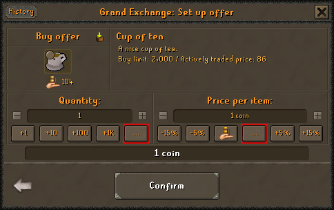
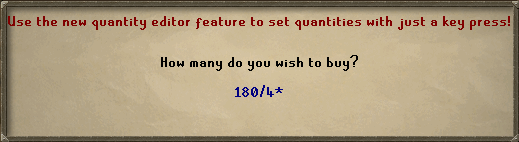

# GE Calc

A [RuneLite](https://github.com/runelite/runelite) plugin that add the ability to use math/s to set price and quantity
in the Grand Exchange and Bank windows and allows the entry of decimal values when using the `k`, `m`, `b` and `t` unit
identifiers. See [Usage](#usage) and [Examples](#examples) below.

| This is a personal project and it probably won't receive any major feature updates. But I try to fix things when they break. |
|------------------------------------------------------------------------------------------------------------------------------|

------

## Usage

_The plugin works with most number input windows in game, such as the "X" buttons in the bank. The example below cover
the Grand Exchange._

| _Most number input windows contain an asterisk '*' at the end of the text field. This is only visual and does not impact the calculated result._ |
|--------------------------------------------------------------------------------------------------------------------------------------------------|

Click the "Enter Quantity" or "Enter Price" buttons in the Grand Exchange UI...

Type in your expression and press Enter/Return to set the quantity or price.

-------

## Examples

You can use decimals with units, expressions, or both at the same time:

| Input  | Result            |    | Input     | Result |    | Input          | Result            |
|--------|-------------------|----|-----------|--------|----|----------------|-------------------|
| 5.63k  | 5,630             |    | 45 * 4    | 180    |    | 2.56m + 0.12b  | 122,560,000       |
| 8.5m   | 8,500,000         |    | 180 / 4   | 45     |    | 5.6b / 24.7m   | 226               |
| 1.024b | 1,024,000,000     |    | 100 + 100 | 200    |    | 13.8k + 11.3k  | 25,100            |
| 1.245t | 1,245,000,000,000 |    | 100 - 50  | 50     |    | 1.1t - 364.55m | 1,099,635,450,000 |

_The plugin only supports one operator at a time, so expressions like `1.4m * 2 / 200k` won't work._

_If the result of a calculation is greater than the new max cash value, the maximum possible value (2,149,631,130,647)
is used._

------

## Bugs, Issues & Requests

If you do run into any bugs, find any issues, or want to request any changes or additions,
please [create an issue](https://github.com/cman8396/GECalc/issues/new). I am an "anything
but Java" developer so be patient.

------

## Changelog

| Version | Description                                                                                                                                                                                                                           |
|---------|---------------------------------------------------------------------------------------------------------------------------------------------------------------------------------------------------------------------------------------|
| 1.3.1   | Fixed error logging following RuneLite plugin review.                                                                                                                                                                                 |
| 1.3.0   | Fixes for [GE Improvements: Beyond Max Cash](https://oldschool.runescape.wiki/w/Update:GE_Improvements:_Beyond_Max_Cash) update:  <li>Fix for new GE price entry window.</li><li>Added support for new `t` (trillions) unit.</li> |
| 1.2.x   | Now supports more complex expressions, such as `13.8k + 11.3k` for a result of `25100`.                                                                                                                                               |

------

## License

GE Calc is licensed under the BSD 2-Clause License. See LICENSE for more.

------

## Author

cman8396, LargeChongus