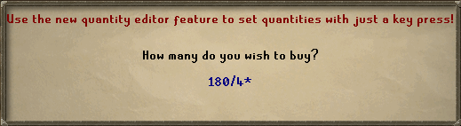

GE Calc  

------
| ⚠ DISABLED ⚠️ The plugin has been disabled in the RuneLite plugin-hub as multiple reports were received via Github and the RuneLite discord server that this plugin causes all in-game quantity input boxes to error following the Varlamore Part 2 update on 25th September 2024.  If you would like to contribute and fix the error, please submit a pull request and i'll be happy to pull into the plugin-hub.
| --- |

------
| This was a personal project, and probably won't receive any further updates. Feel free to fork and modify the repo.
| --- |

A [Runelite](https://github.com/runelite/runelite) plugin that add the ability to use math/s to set price and quantity in the Grans Exchange window, and enabled the entry of decimal values when using the k, m, and b unit identifiers. See usage below.

Usage
------
The plugin enabled the use of expressions to set the price and/or quantity using the Grand Exchange.

| Input  | Result |
| ------------- | ------------- |
| 45 * 4  | 180  |
| 180 / 4  | 45  |
| 100 + 100  | 200  |
| 100 - 50  | 50  |

This plugin also allows entering of decimal values followed by a unit:

| Input  | Result |
| ------------- | ------------- |
| 5.63k  | 5,630  |
| 8.5m  | 8,500,000  |
| 1.024b  | 1,024,000,000  |

| The Grand Exchange quantity and price input windows contain an asterisk '*' at the end of the text field. This is only visual and does not impact the result.
| --- |

Bugs & Requests
-------
If you do run into any bugs please [create an issue](https://github.com/cman8396/GECalc/issues/new). I am an "anything but Java" developer so be patient.

License
-------
GE Calc is licensed under the BSD 2-Clause License. See LICENSE for info.

Author
------
cman8396, LargeChongus
